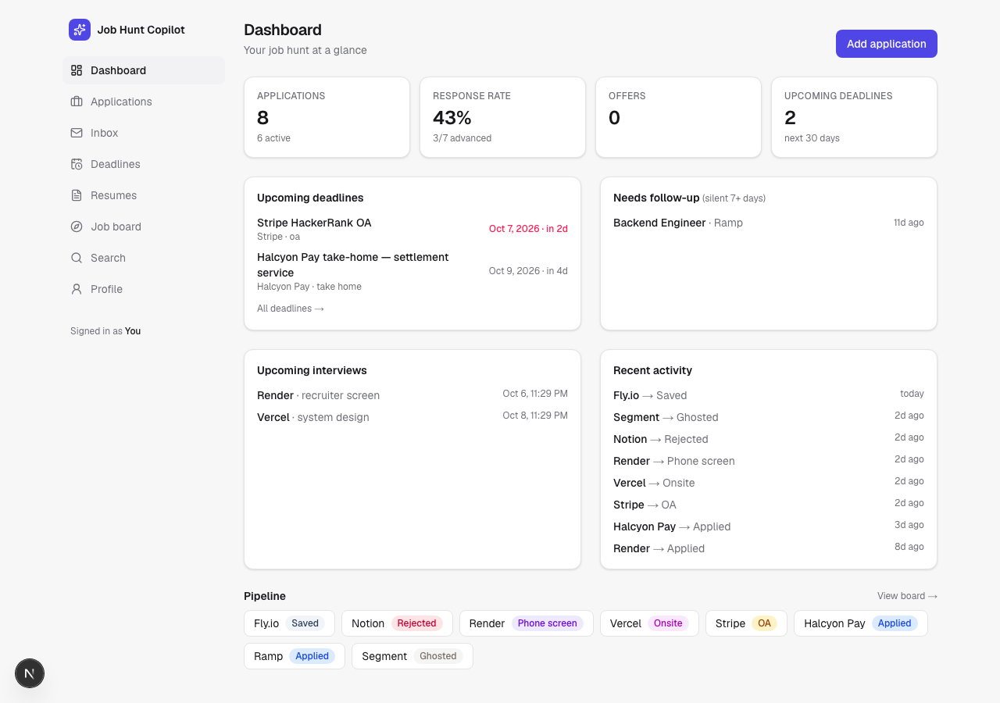
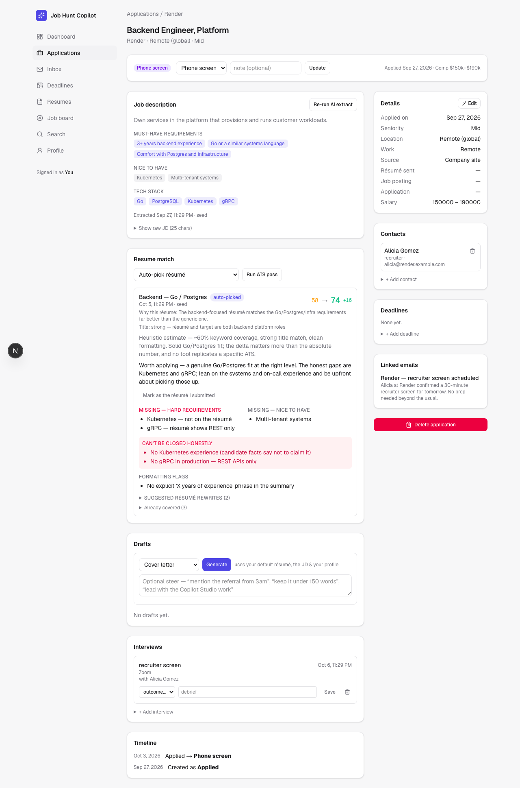
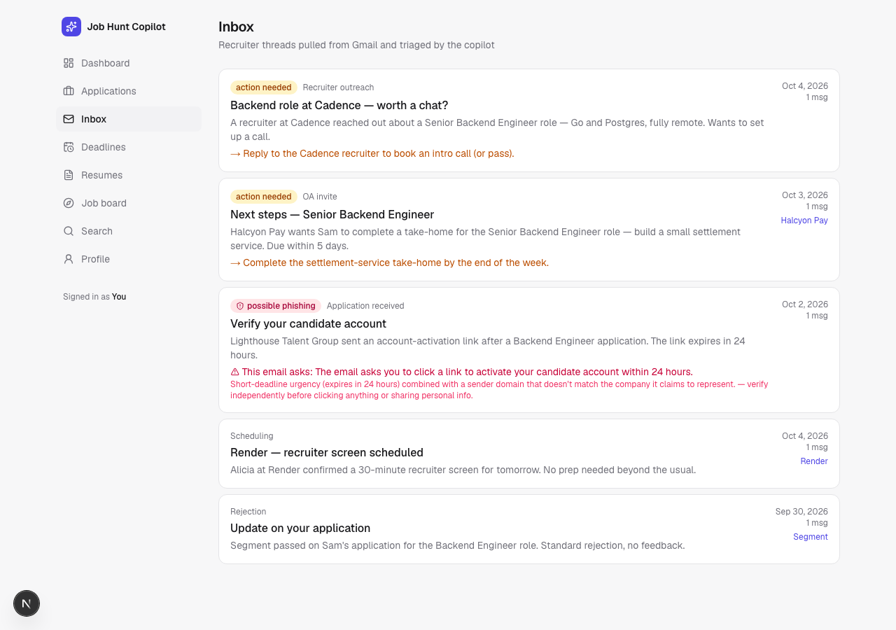

# AI Job Hunt Copilot

[](https://github.com/shagun0915/job-hunt-copilot/actions/workflows/ci.yml)
[](LICENSE)
[](https://job-hunt-copilot-nu.vercel.app)

A single-user command center for a software job search — track every application,
recruiter email, OA deadline, interview and résumé version in one place, with an
LLM handling the tedious parts: reading job descriptions, triaging the inbox,
scoring résumé fit, drafting outreach.

I built it for my own search. It also stands as a portfolio piece for
LLM-application engineering: structured extraction with Zod-validated schemas, a
provider-agnostic model layer, graceful degradation when keys are absent, and an
OAuth-backed Gmail integration — deployed, with CI and migrations on every push.

**Live:** [job-hunt-copilot-nu.vercel.app](https://job-hunt-copilot-nu.vercel.app)
— sign-in is restricted to my own Google account, so a visitor lands on the
sign-in screen rather than the app itself. The screenshots below, the
walkthrough script, and `npm run db:seed:demo` are how to see it without my login.

> A [3-minute walkthrough script](docs/DEMO_SCRIPT.md) and a demo dataset
> (`npm run db:seed:demo`) are included for a video tour.

## Screenshots

**Dashboard** — response rate, upcoming deadlines/interviews, and the pipeline at a glance.


**ATS pass** — before→after score, the keyword gap split into hard requirements
vs. nice-to-haves, and the gaps it refuses to paper over.


**Inbox triage** — a demo thread modeled on a real phishing email this feature
caught in my own inbox, correctly flagged instead of being echoed as a trusted
next step.


## Features

| Area | What it does |
| --- | --- |
| **Application tracker** | Kanban + list, full status pipeline, contacts, comp, work arrangement, which résumé version you submitted |
| **JD extraction** | Paste a job description → structured summary, must-haves, nice-to-haves, tech stack and **red flags** |
| **ATS pass** | Résumé-to-JD match score, **before → after**, with the gaps it won't fabricate a fix for — listed, not papered over |
| **Candidate profile** | One record of facts (availability, employment status, a "never claim" list) that keeps every AI-written word accurate |
| **Gmail inbox sync** | Triages recruiter email, links threads to applications, extracts deadlines, flags likely phishing |
| **Deadlines & interviews** | OA/take-home/respond-by tracking, prep notes, outcome + debrief |
| **Draft generator** | Cover letters, recruiter replies, referral asks, cold outreach, follow-ups — from your real résumé + profile |
| **Job board** | Pulls open roles straight from company ATS boards (Greenhouse, Lever, Ashby) — no API key needed |
| **Semantic search** | Ask in plain language across every application and email ("who ghosted me after an onsite") |
| **Dashboard** | Response rate, offers, needs-follow-up, upcoming deadlines & interviews at a glance |

Every integration **degrades gracefully**: with no AI key the tracker still
works; with no Google OAuth the app runs ungated in local single-user mode.

## Stack

Next.js 16 (App Router, Server Actions) · PostgreSQL + Prisma 6 (Supabase) ·
NextAuth v5 (Google) · any OpenAI-compatible LLM endpoint with JSON-mode +
Zod-validated output · Tailwind v4 · Vitest + GitHub Actions CI · Vercel

## Quick start

```bash
git clone https://github.com/shagun0915/job-hunt-copilot.git
cd job-hunt-copilot
cp .env.example .env && npm install
npm run db:up && npm run db:migrate && npm run db:seed
npm run dev   # http://localhost:3000
```

Runs immediately with **zero API keys** — the full tracker and job board work
out of the box. Adding an LLM key and Google OAuth unlocks the AI features and
Gmail sync; full setup, deployment and architecture are in
[**docs/ENGINEERING.md**](docs/ENGINEERING.md).

## Engineering & security highlights

- Every LLM call is JSON-mode + Zod-validated — structured output, not prose
  scraped after the fact.
- Nonce-based CSP, Row Level Security on every table, zero secrets ever
  committed (`gitleaks`-clean history).
- A real phishing email caught during testing is now auto-flagged in the
  inbox instead of being echoed as a trusted next step.
- CI proves the graceful-degradation contract on every push by running the
  full pipeline — migrate, typecheck, lint, test, build — with **no API keys set**.

Full write-up — architecture, deployment, and the security model in
detail — lives in [**docs/ENGINEERING.md**](docs/ENGINEERING.md).

## License

[MIT](LICENSE) © Shagun Yadav
